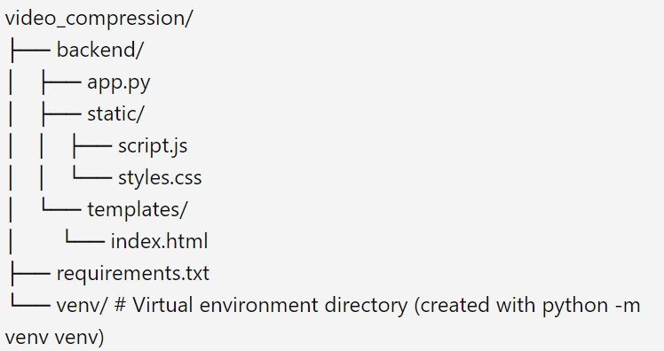

# Video Compression Tool

This is a simple web application for compressing video files to a desired percentage of their original size. The application is built using Flask for the backend and HTML, CSS, and JavaScript for the frontend. It utilizes `ffmpeg` to handle video compression.

## Features

- Upload video files for compression.
- Adjust compression level using a slider (1% to 100%).
- Download the compressed video file.

## Requirements

- Python 3.x
- Flask
- Werkzeug
- Waitress
- `ffmpeg` installed and added to system PATH

## Installation

1. **Clone the repository**:

    ```sh
    git clone https://github.com/yourusername/video-compression-tool.git
    cd video-compression-tool
    ```

2. **Create and activate a virtual environment**:

    ```sh
    python -m venv venv
    source venv/bin/activate  # On Windows use `venv\Scripts\activate`
    ```

3. **Install the required packages**:

    ```sh
    pip install -r requirements.txt
    ```

4. **Install `ffmpeg`**:
    - Download the static build of `ffmpeg` from the [official ffmpeg website](https://ffmpeg.org/download.html).
    - Extract the zip file to a location on your system, e.g., `C:\ffmpeg`.
    - Add the `bin` directory of the extracted folder to your system PATH:
        - Open the Start menu and search for "Environment Variables".
        - Click on "Edit the system environment variables".
        - In the System Properties window, click on the "Environment Variables" button.
        - In the Environment Variables window, find the "Path" variable in the "System variables" section and select it, then click "Edit".
        - Click "New" and add the path to the `bin` directory of your extracted `ffmpeg` folder, e.g., `C:\ffmpeg\bin`.
        - Click "OK" to close all the windows.

5. **Verify `ffmpeg` Installation**:
    - Open a new Command Prompt window and type `ffmpeg -version`.
    - Ensure `ffmpeg` and `ffprobe` are correctly installed and accessible.

## Running the Application

1. **Navigate to the `backend` directory**:

    ```sh
    cd backend
    ```

2. **Run the server using Waitress**:

    ```sh
    python -m waitress --port=8000 app:app
    ```

3. **Open your web browser and navigate to**:

    ```
    http://127.0.0.1:8000/
    ```

## Project Structure



## Usage

1. **Upload a video file**: Click the "Choose File" button and select a video file from your computer.
2. **Adjust compression level**: Use the slider to choose the desired compression level (1% to 100%).
3. **Compress the video**: Click the "Compress Video" button to start the compression process.
4. **Download the compressed video**: Once the compression is complete, the compressed video will be automatically downloaded.

## Troubleshooting

- If you encounter issues with `ffmpeg` not being found, ensure that the `ffmpeg` and `ffprobe` paths are correctly added to your system PATH.
- Make sure all required Python packages are installed in your virtual environment.

## License

This project is open for suggestions and improvements. Feel free to contribute.
